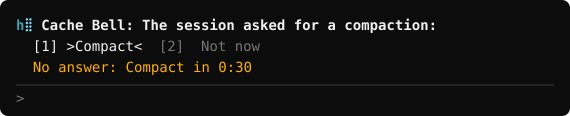
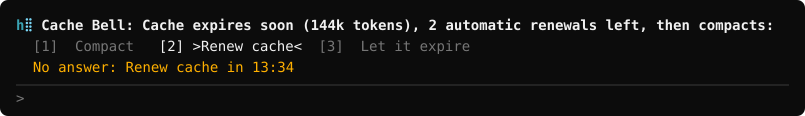
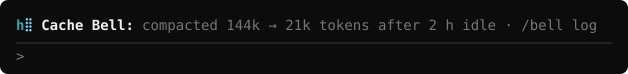
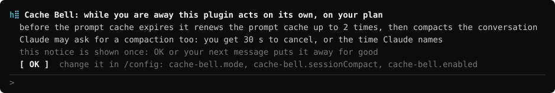

<h1>
  <picture>
    <source media="(prefers-color-scheme: dark)" srcset="docs/hb-mark-dark.svg">
    
  </picture>
  Cache Bell
</h1>

   

**Saves your tokens and limits.** Stops a long Claude Code session from spending them on re-sending its
whole context after a break.

**1. Claude can compact the conversation itself**, once a piece of work is done. You can cancel.



**2a. Prolongs the warm cache while you are away.** Twice by default, three times at most; you can set
your own workflow.



**2b. Compacts an idle session while the cache is still warm**, not after it has expired.


**3. Shows whether the cache is still warm or already cold.** On an hour-long cache the countdown
appears once 30 minutes or fewer are left.


While you are away it asks first; with no answer it acts on its own, and those requests count against
your plan. With `cache-bell.mode` = `notify` and `cache-bell.sessionCompact` = `wait` nothing is sent
without your answer.

[Quick start](#quick-start) · [How it works](#how-it-works) · [What it sends](#what-it-does-on-its-own-and-what-it-sends) · [Privacy](#privacy)

## Quick start

In your shell:

```
claude plugin marketplace add hollerbell/cache-bell
claude plugin install cache-bell@cache-bell
```

Then open a new session, or run `/reload-plugins` in one that is open:

- `/bell demo 30` shows the question for 30 seconds and sends nothing;
- `/bell status` says the plugin's version and what it sees.

In a conversation below 100 000 tokens the plugin only shows the countdown: it does not ask, renew or
compact on its own.

To update later, since Claude Code does not update this plugin on its own:

```
claude plugin marketplace update cache-bell
claude plugin update cache-bell@cache-bell
```

Then run `/reload-plugins` in every session that is open. Installed from a clone, or to have it updated
automatically: see [Update](#update).

To try it for one session without installing, clone the repository and run in the clone:
`claude --plugin-dir .`

0.2.12, experimental. Needs Claude Code 2.1.288 or newer (the mods API, which is early access and
changes between releases). Tested on Windows (terminal); macOS and Linux are not tested yet.

**Feedback is welcome.** Tell us what works, what breaks and what is missing: [open an issue](https://github.com/hollerbell/cache-bell/issues).

## Three ways to use it

1. **Leave a long session over lunch.** Do nothing: before the cache runs out the band asks, renews the
   cache twice and then compacts, so your first message after the break does not send the whole context
   again.
2. **Decide yourself.** When the question appears, type `2` and Enter to keep the cache warm, `1` to compact
   now, `3` to let it expire. `/bell demo 30` shows the question without sending anything.
3. **Let Claude pick the moment.** Say "compact when you are done with this task". Claude finishes, asks the
   plugin for a compaction, and you get 30 seconds to cancel.

## Commands

| Command | What it does |
| :- | :- |
| `/bell` or `/bell status` | The plugin's version and what it sees: the state, the TTL and where it comes from, the time of the last request, what comes next and when. While Claude is working it is shown at once, as a notice of one line. |
| `/bell report` | What a report of a problem needs, to paste into an issue: the versions, the model, whether another provider or an API address of your own is set, the options, the state, the counts of the events the plugin has seen, the size of the transcript and the usage figures of its last response, and the plugin's last notices, of each only the plugin's own words. No message text, no file path, no address, no key. Typed while Claude is working, it is printed when the turn is over. |
| `/bell log [count]` | The last compactions, ten when no count is given, 200 at most. |
| `/bell demo [seconds] [bg] [stay]` | Shows the question for that many seconds (1 to 600, 30 when none is given) and sends nothing. `bg` swings the background instead of the text; `stay` keeps the question up when you send a message. |
| `/bell show calm\|act\|cold\|intro` | Holds the band in one of its looks, or puts the first-run notice up, for a screenshot. `/bell show off` puts the real band back. |

Started with the environment variable `CACHE_BELL_DEMO=30`, a session shows the demo question by itself,
for 30 seconds; `CACHE_BELL_DEMO="30 bg"` swings the background.

None of these sends anything to the model.

## Options

Set them in `/config` (rows named `cache-bell.*`) or in `settings.json` under
`pluginConfigs["cache-bell@cache-bell"].options` (loaded with `--plugin-dir`, the key is
`cache-bell@inline`).

| Option | Default | What it sets |
| :- | :- | :- |
| `enabled` | `true` | Off pauses the plugin without uninstalling it: it shows and sends nothing. |
| `mode` | `prepare-compact` | The preset, see [What it does on its own](#what-it-does-on-its-own-and-what-it-sends). |
| `ask`, `maxRenewals`, `renewMethod`, `prepareBeforeCompact`, `compact` | | The behaviour under `mode: custom`. `ask`: `first`, `every` or `never`. `renewMethod`: `fork` or `none`. |
| `preparePrompt` | `This conversation will be compacted right after this turn. Nothing is needed from you: a one-line reply is enough.` | What the session is told before a compaction. Empty = nothing. |
| `pingPrompt` | `This request only keeps the prompt cache warm. Answer with the single word: ok` | The prompt of a renewal. |
| `compactInstructions` | empty | Instructions for the summary, as after `/compact`; `{time}` and `{idle}` are filled in. |
| `ttl` | `auto` | `5m` or `1h` sets the cache lifetime by hand. |
| `minContextTokens` | `100000` | Below this nothing is done about an expiring cache. A compaction Claude asks for is not affected. |
| `askLeadMinutes` | `0` (automatic) | How long before the time to act the question appears. |
| `sessionCompact` | `confirm` | What Claude's own request does: `confirm` asks you and compacts when the countdown ends, `wait` asks you and compacts only if you say so, `auto` compacts at once, `off` refuses. |
| `compactCountdown` | `30` | Seconds you have to cancel a compaction Claude asked for. Claude may name a time of its own with a request, 10 to 600 seconds. |
| `display` | `band` | `band`, `status` (the status line), `both` or `off`. |
| `showBelowMinutes` | `30` | The countdown shows once this many minutes or fewer are left; `0` = always. |
| `readTranscript` | `true` | Off: the transcript is never read, and the cache lifetime comes from the Claude Code settings, a model switch or `ttl`. |

## How it works

Claude Code keeps your conversation cached at the API for 5 minutes or 1 hour. Come back later than
that and your next message sends the whole context again, uncached.

Cache Bell counts that time down above the prompt and acts before it runs out. What it does then, and
what that sends, is under [What it does on its own](#what-it-does-on-its-own-and-what-it-sends).

Claude Code compacts an idle session on its own only above roughly 200k tokens. Cache Bell covers the
sessions below that, asks first, and can keep the cache warm instead of compacting.

Measured once (Claude Code 2.1.288, Windows, Haiku, a subscription plan, `minContextTokens` set to
40 000): an hour-long cache was renewed at minute 50. A message at minute 63 read the whole context,
42 571 tokens, from the cache and wrote 374.

The pictures are drawings, not screenshots: they use the plugin's own texts and colours on a dark terminal.
A light theme gets darker colours.

## Answering the question

- The first line says why it asks, how large the context is that would be sent again, and how many
  renewals the plugin would still do on its own.
- The choice between the arrows is the one that is done when the countdown on the last line ends.
- Type a choice's digit into the empty prompt to select it; Enter does it at once. The digit is not sent
  to the model.
- A click on a choice does it at once.
- Any other message you send closes the question: your turn renews the cache anyway.
- A message from another session, or a background task's result, only interrupts the question: when that
  turn ends, a compaction Claude asked for is offered again, with the time the countdown had left and at
  least ten seconds. A digit you had typed still selects its choice.
- While a question is open, a message that is exactly one of its digits answers the question, even if
  Claude has just asked you to pick "1 or 2". Write more than the digit to answer Claude.

## What it does on its own, and what it sends

After installation the plugin runs the preset `prepare-compact`. While you are away it asks, and when
nobody answers it renews the cache twice, then asks once more, tells the session and compacts the
conversation. The second question has `Compact` selected, so whoever is at the machine can still say no.
On an hour-long cache that is a compaction after about two and a half idle hours; on a five-minute cache
after twelve minutes.

A renewal is one request that reads the whole context from the cache, the announcement is one short
turn, a compaction is one summary. A compaction replaces the conversation with that summary: what the
summary leaves out is gone from the context. These requests count against the limits of your plan, or
are billed to your API key. No preset sends more than three renewal requests in one idle period, answered
or not; only your own message starts the count over.

A conversation below 100 000 tokens is left alone: the plugin only shows the countdown
(`minContextTokens`).

| Preset | What it does | Requests the cache timer sends without your answer |
| :- | :- | :- |
| `notify` | Countdown and question. | none |
| `prepare-compact` (default) | Asks, renews twice, asks again, announces, compacts. | at most five per idle period: two renewals, one retry if a renewal got no answer, the announcement, the compaction |
| `compact-only` | Compacts before the cache expires. No question, no renewal, no announcement. | one per idle period |
| `keep` | Renews the cache silently, three times at most, then lets it expire. Never compacts. | at most three per idle period |
| `custom` | Uses the options `ask`, `maxRenewals`, `renewMethod`, `prepareBeforeCompact`, `compact`. | as set; `maxRenewals` is 0 to 3 |

Claude itself may also ask for a compaction once its work is done: the skill `compact` tells it when, and
it asks through the plugin's tool `compact`. You get 30 seconds to cancel, or the time Claude asked for
(10 to 600 seconds; less when the cache runs out sooner); without an answer the conversation is compacted.
When you ask Claude for the compaction yourself, in your own message, the countdown is three seconds.
When to ask is yours to say, for example "compact after every finished task" or "only suggest it". With
`cache-bell.sessionCompact` = `wait` nothing is compacted unless you say `Compact`; with `auto` it
compacts without the countdown.

A compaction leaves the session idle until somebody writes. So when Claude asks for a compaction, it may
leave itself a note about what comes next. Once the compaction is done, the plugin sends that note back as
a prompt, and the question, when there is one, says that the session `will continue after it`. The note is
marked as Claude's own, not as your message. The note is not sent when you cancel, when you send a message
during the countdown, when the prompt box holds a message you are writing, when other work has started
since the compaction began, or when the compaction fails. After three compactions in a row that were
followed by a note, no further note is sent until you write a message. A compaction started by the cache
timer never sends a note.

A compaction the timer starts waits while you type (a key in the prompt box within the last minute) and
while a subagent of the session still runs. It never waits past the cache: if the cache runs out first,
nothing is compacted and the band says so. Text that only lies in the prompt box holds nothing back, and
neither does a background shell command. Your own answer `Compact` is carried out at once.

After a compaction of its own the band says what was done, until your next message:



To change what it does, in `/config`:

- `cache-bell.mode` = `notify`: countdown and question only, the cache timer sends nothing without your
  answer;
- `cache-bell.sessionCompact` = `wait`: a compaction Claude asks for waits for your answer;
- `cache-bell.sessionCompact` = `off`: Claude's own request is refused;
- `cache-bell.enabled` = off: the plugin shows and sends nothing until you turn it on again.

The first time the plugin runs on a machine, the band says the same and stays up until you press OK or
send a message.



## How the time is counted

The cache lifetime runs from the moment the **last request was sent to the API**, not from the end of
the turn. A turn that runs tools for two minutes after its last request has two minutes less.

| | 5-minute cache | 1-hour cache |
| :- | :- | :- |
| the question appears | 3:30 | 35:00 |
| time to act | 4:00 | 50:00 |
| too late | 4:35 | 55:00 |

The countdown in the band runs to "too late", the last moment a request is still sure to hit the cache.
After a compaction the plugin sleeps until you work in the session again.

The TTL is taken from the `ttl` option if it is set; otherwise from the newer of the transcript (what
the API really granted) and the last model switch; before either is known, from the Claude Code settings
(`FORCE_PROMPT_CACHING_5M`, `CLAUDE_CODE_PROMPT_CACHE_TTL`, `promptCacheTtl`). When nothing is known,
5 minutes is assumed, and the band says so beside the countdown:
`lifetime 5m assumed, not yet seen in the data`.

The transcript is read when a turn ends, and once its TTL is confirmed no more than every two minutes;
a transcript that did not grow is not read at all. If it cannot be read and nothing else names the TTL,
the five minutes are only a guess: the band says so, the plugin tries again (after 15 seconds, after a
minute, then every five minutes), and until a read goes through it does not ask, renew or compact.

A session you resume (`claude --resume`, `--continue`, a fork) starts in a new process that has sent no
request yet. The plugin then reads the TTL and the time of the last request from the transcript right
away, so the band and `/bell status` show from the start how long the cache still lives, or that it ran
out while the session was closed. From there the session is watched like any other: with time left, the
plugin asks, renews and compacts as the mode says. Where the transcript is not read or cannot be, the
time comes from Claude Code, which says how long ago the last response came. The TTL then comes as
described above: from the `ttl` option or the Claude Code settings; with neither, five minutes are assumed
when `readTranscript` is off or the session keeps no transcript, and when the read failed the plugin
waits for it and does not ask, renew or compact. A session that was compacted after its last response is
left alone until you work in it, as after any compaction.

## The log of compactions

Every compaction of the conversation is logged: the plugin's own, your `/compact`, and the one Claude Code
runs when the context is full. `/bell log` prints the last ten, `/bell log 50` the last fifty:

```
Compactions, the last 2 of 2 kept:
2026-10-04 01:12  143 985 → 21 400 tokens · the session asked, no answer · session abcd1234 · "the task is done"
2026-10-04 09:40  96 210 → 18 030 tokens · the cache was about to expire, you chose · session 77e0c2aa
```

Each line says when, the size of the context before and after, why and who decided, the session, and what
the session said when it asked. The log is kept in the plugin's store on this machine (a JSON file under
the Claude Code configuration directory), the last 200 entries, for all sessions together.

## Limits

- Cache Bell works on one session: the one it runs in. Its options live in Claude Code's settings (user
  or project); there is no setting for a single session.
- In `claude -p` and under the SDK the plugin does nothing and registers no command.
- A compaction waits for your typing and for running subagents (see
  [What it does on its own](#what-it-does-on-its-own-and-what-it-sends)), not for a background shell command: a server left
  running would hold every compaction back. Renewals wait for nothing.
- Where a large transcript cannot be read (no process can be started, see [Privacy](#privacy), or the
  machine is too busy to answer in ten seconds), the TTL stays what the settings or a model switch say.
  With neither, the plugin only shows that it does not know, until a read goes through.
- Claude Code itself compacts idle sessions above roughly 200k tokens (since 2.1.286). The plugin sees
  that compaction and goes to sleep after it.
- The colours for a light background are tested, but not yet checked in a real light terminal.
- The plugin uses only the official mods API and does not patch Claude Code.

## Privacy

Cache Bell makes no network connections of its own: its requests go to the model through Claude Code, like
your own messages, and nothing else leaves the machine. Those requests are the renewals, the announcement
before a compaction, the compaction itself, and the note sent back after it. What a `/bell` command prints
is no request of the plugin's: like the output of any command, Claude Code keeps it in the session's
transcript and hands it to Claude with your next message.

What it reads:

- the Claude Code settings, for one key: `promptCacheTtl`. The mods API hands a plugin the settings as one
  object; nothing else of it is used, kept or logged;
- the environment variables `FORCE_PROMPT_CACHING_5M`, `CLAUDE_CODE_PROMPT_CACHE_TTL`, `OS` and
  `CACHE_BELL_DEMO`;
- only when you run `/bell report`, five more environment variables: `CLAUDE_CODE_USE_BEDROCK`,
  `CLAUDE_CODE_USE_VERTEX`, `CLAUDE_CODE_USE_FOUNDRY` and `DISABLE_PROMPT_CACHING`, for whether each is
  switched on, and `ANTHROPIC_BASE_URL`, for whether it is set at all. Of these five the report says yes
  or no; the address itself is not shown, kept or logged. Of the variables named above it says whether
  `FORCE_PROMPT_CACHING_5M` is on, and shows the value of `CLAUDE_CODE_PROMPT_CACHE_TTL` when it is a word
  of at most eight letters and digits. The report also reads the transcript (a file up to 4 MiB
  whole, of a larger one the last 1 MiB) for the number of responses, the usage figures of the last one,
  and the model and the Claude Code version its row names; with `readTranscript` = off it only asks whether
  the file exists and how large it is. Beside these the report holds the plugin's version, the
  system (Windows or not), the surface the session started on as Claude Code names it, the model's name
  of the last request (a name that begins with `arn:`, holds twelve digits in a row, is longer than 80
  characters or holds anything but letters, digits and `. _ @ : [ ] -` is not shown), the size of the
  context, the options (of the three texts you can change only which ones are changed, not the texts),
  the state, how many times Claude Code reported the session's start and the end of a turn to the plugin,
  how many of those came with the transcript's path, and the number of requests of the main thread it
  counted, and the last notices the plugin wrote to Claude Code's log: of each only the
  plugin's own words and an error's code or name, never the error's text. The plugin sends it nowhere.
  Like the output of any command, Claude Code keeps it in the session's transcript and hands it to Claude
  with your next message;
- the session's transcript file, for the cache TTL the API granted: only the usage figures of its last
  lines, nothing of what was said, and nothing of it is kept. When a session is resumed, also the time of
  the last message a response followed, for when the last request went out. For that it also looks
  whether a message begins with `<`, the mark of a command's output; nothing else of the message is read
  into account or kept. `readTranscript` = off stops it. Of a transcript above 4 MiB only the end is read:
  what was appended since the last read, no less than 64 KiB and 1 MiB at the most. For that the plugin
  starts `tail` (PowerShell on Windows);
- Claude Code's configuration rows (the `/config` menu). The mods API hands a plugin all of them as one list;
  it uses the theme, to pick colours for a light or a dark background. The other rows are not used, kept
  or logged;
- changes of the prompt box, as you type: while a question is open, to see whether the box holds one of
  the question's digits (when a second digit is typed after the first, it puts that digit alone into the
  box); at any time, to note when you last typed. What you typed is not kept or logged, only the time;
- the list of the session's subagents, for whether one still runs;
- every message that is sent, at the moment it is sent: its text and where it comes from (you, another
  session, a background task, a plugin). The text is compared with the digits of an open question and with
  the plugin's own prompts, and is not kept or logged. A message that is exactly a digit of the open
  question is your answer: the plugin takes it and does not let it reach Claude;
- when each request to the model is sent, when a turn starts and ends and how it ended, and each compaction
  with its sizes before and after: the times, the counts and the reasons, nothing of what was said. From
  0.2.10 also the model's name of the last request, held in memory for `/bell report` and not written
  anywhere;
- the size of the context in tokens, as Claude Code counts it;
- the session id, for its first eight characters in the log of compactions;
- the path of the session's transcript file, which Claude Code hands over at the end of a turn and when
  a session is resumed. With a resumed session Claude Code also says how long ago its last response came
  and how large its context was; the plugin uses both and keeps them as it keeps the times and sizes
  above;
- the cache TTL Claude Code reports when you switch the model;
- its own manifest (`plugin.json`), for the version `/bell status` shows;
- one value another plugin may keep in the session's state: whether the plugin built on this one
  (`holler-bell`) runs in the session. When it does, Cache Bell stands down: it shows nothing, asks nothing
  and compacts nothing;
- its own store, described below: at the start, for whether the first-run notice was seen, and for
  `/bell log`.

What it writes. In its own store (a JSON file of the plugin under the Claude Code configuration
directory; with Claude Code 2.1.288 in `plugins/store/`):

- that the first-run notice was seen. While the notice is up in a session, the plugin reads this back
  every three seconds, so that OK in one session puts the notice away in the others;
- the log of compactions, which `/bell log` shows you, one entry for each: the time, the sizes before and
  after, the cause and who decided, the first eight characters of the session id, and the one sentence
  Claude gave as its reason when it asked for the compaction (at most 200 characters; nothing else of the
  conversation). The log holds the newest 200 entries, older ones are dropped.

Elsewhere:

- in the session's state, which Claude Code keeps for plugins: where the plugin stands (the phase, the
  times of the last request and of the next step, the cache TTL and where it comes from, the size of the
  context, the counts of renewals and questions) and the path of the transcript file. Nothing of the
  conversation;
- in Claude Code's log, a line when something fails or is not done: the transcript or the settings could
  not be read, a renewal or a compaction failed, a prompt of the plugin's was not sent. A line holds the
  error as Claude Code gave it, which may name a file's path, and nothing of the conversation.

What it only holds in memory: the note Claude may leave with a compaction request, and the plugin's last
eight notices, cut as described under `/bell report`, and the counts of events that `/bell report` shows:
numbers only, counted since the plugin was loaded (a reload starts them at zero) and not written anywhere. The plugin keeps the note until the compaction is done or called off, sends it back as a prompt after a compaction that went
through, unless one of the cases named above holds, and does not write it anywhere itself. Claude Code
records the request and the prompt in the session's transcript on this machine, as it does every tool
call and prompt.

What it changes in the transcript, through the interface Claude Code gives plugins for it: two notices
Claude Code writes there itself. The line saying that a hook dropped a prompt, written when you answer a
question with a digit, is replaced by a line that names the choice. The line Claude Code writes after it
loaded the plugin again is cut to its first part, without the list of hooks. No other line is touched.

What its prompts carry. The announcement before a compaction carries the text of the option `preparePrompt`
and nothing else; its default is in the table of options. A renewal carries the text of the option
`pingPrompt`. The note sent back after a compaction carries Claude's own note, between sentences of the
plugin that say whose note it is. A compaction carries the instructions of the option
`compactInstructions`, when it is set, with the time filled in. Nothing the plugin reads from a file goes
into any of them.

What it hooks. It serves two things of its own through hooks: the command `/bell` (a hook on
`command.run`, for that command only) and the tool `compact`, which it registers itself (a hook on
`tool.call`, for that tool only; the hook answers in the tool's place, since the tool has no other code).
It answers no other command and no other tool, and takes no permission decision. Its other hooks on events
that are also calls: `prompt.submit`, for the messages that are sent, and `session.append`, for the two
notices in the transcript, both as said above; `config.set`, for the theme only, passed on unchanged;
`session.compact`, passed on unchanged, to log the compaction. It listens to three of Claude Code's hook
events and passes each on unchanged: `Stop`, for the path of the transcript; `SessionStart`, to learn
that a compaction or a `/clear` happened or that the session was resumed; `PostModelSwitch`, for the
cache TTL of the new model.

It writes nothing to `settings.json` and never asks for credentials. To delete what it kept, delete its
file in the store. It is kept until you do, except that the log drops entries beyond the newest 200.

## Troubleshooting

- **No band above the prompt.** On an hour-long cache it appears once 30 minutes or fewer are left
  (`showBelowMinutes`); before the first answered message there is nothing to count. `/bell status` says
  what the plugin sees.
- **`/bell` is unknown.** The plugin is not loaded: run `/reload-plugins`, or start a new session. In
  `claude -p` and under the SDK the plugin does nothing.
- **The countdown shows, and nothing is asked or done.** The conversation is below `minContextTokens`
  (100 000), or you chose `Let it expire` in this idle period. `/bell status` says which.
- **It says 5m and the cache lives an hour, or the other way round.** `/bell status` shows where the
  lifetime came from. Set `ttl` to `5m` or `1h` to fix it by hand.
- **The band says the lifetime is not known yet.** The transcript could not be read; on Windows a very
  busy machine can make PowerShell too slow to answer. The plugin tries again on its own and until then
  does not ask, renew or compact. To stop depending on the read, set `ttl` to `5m` or `1h`.
- **An option does not seem to apply.** `/bell status` prints the mode in use. If an option in
  `settings.json` is set to a value it does not accept, the default is used instead.
- **The plugin refuses to load after a Claude Code update.** The mods API is early access and changes
  between releases; see the requirements under [Quick start](#quick-start).
- **Something else is wrong.** Run `/bell report` and paste what it prints into an
  [issue](https://github.com/hollerbell/cache-bell/issues). Read it first: it is made to hold nothing
  private, and you are the one who posts it.

Questions and bugs: [open an issue](https://github.com/hollerbell/cache-bell/issues). Security problems: please don't post them
in public, see [SECURITY.md](SECURITY.md).

Replies may come from Bellhop, an automated account of the Holler Bell team that uses an AI assistant; a
person on the team is responsible for every reply.

## Install, in detail

There are two ways to install. Use one; both register a marketplace named `cache-bell`, so remove the one
you have (`claude plugin marketplace remove cache-bell`) before you switch to the other.

**From GitHub.** The two commands of the [Quick start](#quick-start). Claude Code keeps its own copy of the
plugin. Inside a session the same is `/plugin marketplace add hollerbell/cache-bell`, then
`/plugin install cache-bell@cache-bell`, which opens the plugin's details and lets you choose where it
applies.

**From a clone.** Claude Code reads the plugin straight from the clone, so keep the clone where it is:

```
git clone https://github.com/hollerbell/cache-bell.git
cd cache-bell
sh install.sh
```

On Windows the last line is `.\install.bat`. The script runs `claude plugin marketplace add ./` (a bare `.`
is refused) and `claude plugin install cache-bell@cache-bell`.

Either way the install ends with a note that options are not set yet; none has to be, the defaults work.

## Update

Claude Code does not update a plugin from a marketplace like this one on its own, unless you turn
auto-update on for it under `/plugin`, Marketplaces.

**Installed from GitHub:**

```
claude plugin marketplace update cache-bell
claude plugin update cache-bell@cache-bell
```

**Installed from a clone:** run `update.bat` or `sh update.sh` in the clone. It pulls the clone
(fast-forward only) and refreshes the marketplace and the plugin.

Then run `/reload-plugins` in every session that is open; new sessions have the new version.
`/bell status` says which version runs, and [CHANGELOG.md](CHANGELOG.md) what changed in it.

## Remove

```
claude plugin uninstall cache-bell@cache-bell
claude plugin marketplace remove cache-bell
```

The same for both ways of installing; a clone you can then delete. What the plugin kept on the machine
stays until you delete it, see [Privacy](#privacy).

## Development

```
claude plugin validate .
claude plugin test .
```

Layout of the plugin:

| Path | What it is |
| :- | :- |
| `.claude-plugin/plugin.json` | manifest and options (`userConfig`) |
| `hooks/register.tsx` | the only file that touches the mods API (`$`): observes, calls the core, draws |
| `core/` | pure logic without `$`: `timing`, `transcript`, `decide` (the state machine), `ask`, `guards`, `config`, `view`, `report`, `log` |
| `core/extension.ts` | extension point: lets other code add its own reasons to ask for a compaction |
| `skills/compact/` | the skill that tells Claude when and how to ask for a compaction |
| `types/index.d.ts` | the contract of the values kept in `$.state` |
| `tests/core/` | table tests of the core |
| `tests/shell/` | tests of the hooks with a mocked clock |

`tsconfig.json` extends the types Claude Code lays next to a plugin it loads with `--plugin-dir`
(`.claude-plugin/types/`, not kept in the repository): load the plugin that way once and an editor has
the types of the mods API.

The core tests are checked with mutations: each operator and number in `core/` is changed one at a time
and the tests must fail. `python tools/mutate.py .` runs them on a copy of the plugin;
every mutant is one run of the tests, so the whole core takes hours. Name the files to mutate only those:
`python tools/mutate.py . timing.ts guards.ts`.

## Related: Holler Bell

Cache Bell is made by the Holler Bell team. Holler Bell is a closed-source desktop app, free to use, that
runs Claude Code, Codex, shells and SSH sessions in one window and shows which one is waiting for you.
Cache Bell does not need it and is MIT-licensed.

[hollerbell.com](https://hollerbell.com/?ref=cache-bell)

## License

MIT, see [LICENSE](LICENSE).

"Holler Bell", "Cache Bell" and the h⣿ mark are trademarks of FEO digital agency s.r.o. The MIT license covers the code. It does not cover these marks or the logo files hb-mark-light.svg and hb-mark-dark.svg in the docs folder and icon.png in the .claude-plugin folder, which are © FEO digital agency s.r.o., all rights reserved; you may redistribute them unchanged as part of this repository. If you distribute a modified version, please remove or replace the name and the
mark.

From the Holler Bell team. Not affiliated with, endorsed by or sponsored by Anthropic or OpenAI.
